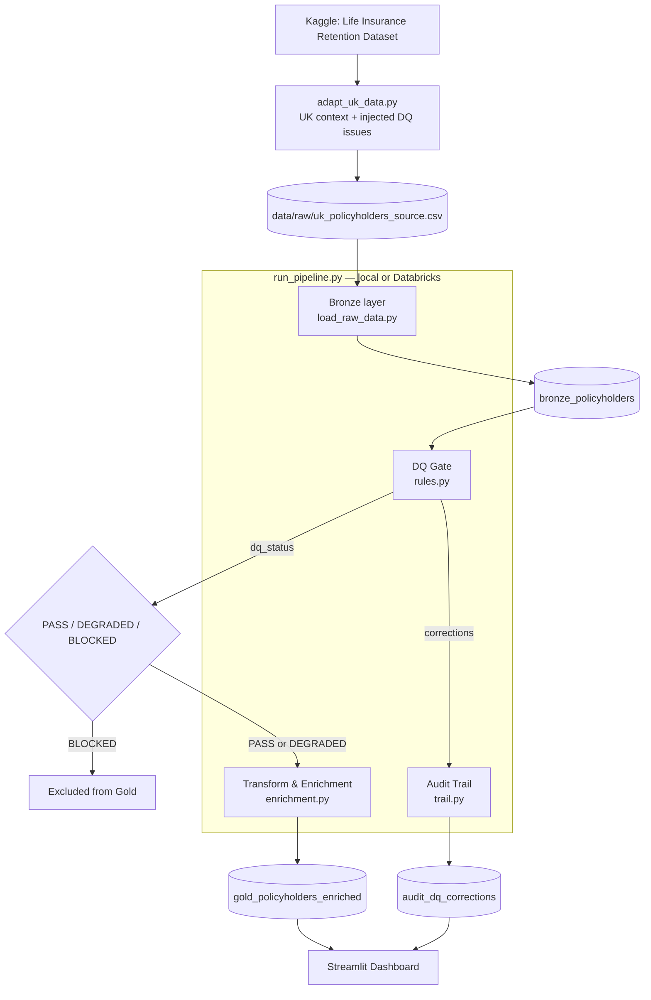

# Insurance Policyholder Data Validation & Assumption-Setting Pipeline

A Databricks-based data pipeline that validates, transforms, and enriches UK life insurance policyholder data for actuarial modelling and assumption setting — deployed end to end to Databricks Free Edition with governed Unity Catalog tables.

---

## Business Problem

This project mirrors a real-world data engineering role in the UK financial services sector: operating and maintaining a BAU (business-as-usual) data pipeline that feeds validated, trustworthy data into actuarial models, without building the actuarial models themselves.

- Actuaries setting assumptions (lapse rate, retention, mortality-adjacent
  factors) need policyholder data that has already been validated and
  enriched, not raw, unchecked source extracts
- Audit and compliance teams need a traceable record of every correction
  applied to the data, to answer internal and external audit queries
- A pipeline running in a regulated financial services environment must
  fail safely: records that cannot be trusted (missing identifiers,
  economically meaningless values) must be blocked from reaching
  downstream models, not silently passed through

---

## Architecture



Bronze, Gold, and audit outputs are written as governed Unity Catalog tables under `workspace.policyholder_pipeline`, and the pipeline runs as a Databricks Job defined via a Declarative Automation Bundle (`databricks.yml`).

---

## Tech Stack

| Layer | Technology |
|---|---|
| Compute | Databricks Free Edition (serverless Spark) |
| Processing | PySpark, Spark SQL |
| Storage format | Delta Lake |
| Governance | Unity Catalog (`workspace.policyholder_pipeline`) |
| Deployment | Declarative Automation Bundles (formerly Asset Bundles) |
| CI | GitHub Actions |
| Testing | pytest |
| Dashboard | Streamlit, Plotly |

---

## Project Structure

<details>
<summary>Click to expand</summary>

```
insurance-policyholder-data-pipeline/
├── .github/
│   └── workflows/
│       └── ci.yml                     # GitHub Actions: pytest on every push
├── data/
│   └── raw/                            # source CSVs (CC0-licensed — committed directly)
├── src/
│   ├── ingestion/
│   │   └── load_raw_data.py            # Bronze layer: source data loading
│   ├── dq_gate/
│   │   └── rules.py                    # Silver layer: PASS/DEGRADED/BLOCKED classification
│   ├── transform/
│   │   └── enrichment.py               # Silver→Gold: policy duration, lapse flag, lapse rate
│   └── audit/
│       └── trail.py                    # Audit trail: logs every DQ Gate correction
├── scripts/
│   ├── adapt_uk_data.py                # Kaggle source → UK-adapted dataset with injected DQ issues
│   └── run_pipeline.py                 # Orchestrates the full pipeline, local or Databricks
├── tests/                              # 18 pytest unit tests across DQ Gate, Transform, Audit
├── dashboard/
│   └── app.py                          # Streamlit app (data quality, business metrics, audit trail)
├── docs/
│   ├── project-plan.md                 # design notes, phased roadmap
│   └── screenshots/                    # deployment evidence referenced in this README
├── databricks.yml                      # Declarative Automation Bundle configuration
├── pytest.ini
├── requirements.txt
└── README.md
```

</details>

---

## Unity Catalog Schema

```
workspace (catalog)
└── policyholder_pipeline (schema)
    ├── bronze_policyholders          # Raw ingestion, untouched
    ├── gold_policyholders_enriched   # PASS/DEGRADED records + derived metrics
    ├── audit_dq_corrections          # Every DQ Gate value correction
    └── raw_data (volume)             # Source CSV storage
```

**Key columns — `gold_policyholders_enriched`**
`policy_id` · `policy_type` · `sum_assured_gbp` · `policy_status` · `policy_duration_years` · `is_lapsed` · `dq_status` · `dq_reason`

**Key columns — `audit_dq_corrections`**
`transformation_id` · `policy_id` · `field_name` · `old_value` · `new_value` · `rule_applied` · `transformed_at`

---

## DQ Gate Rules

| Severity | Rule | Trigger |
|---|---|---|
| BLOCKED | Missing policy identifier | `policy_id IS NULL` |
| BLOCKED | Non-positive sum assured | `sum_assured_gbp <= 0` |
| BLOCKED | Implausible age | `age < 0 OR age > 120` |
| DEGRADED | Gender value standardised | Recognised variant (`f`, `M`, `male`, ...) mapped to Male/Female |
| DEGRADED | Unrecognised gender category | Value outside Male/Female after standardisation |
| DEGRADED | Unrecognised health_status category | Value outside Excellent/Good/Fair |
| DEGRADED | Status/arrears conflict | `policy_status = 'Active' AND months_in_arrears >= 6` |

BLOCKED records are excluded from the Gold layer entirely. DEGRADED records continue downstream with the issue visible via `dq_status` and `dq_reason`.

---

## Pipeline Results

Results from a full run against the 10,000-row UK-adapted source dataset:

| Metric | Value |
|---|---|
| Source records | 10,000 |
| PASS | 9,552 |
| DEGRADED | 226 |
| BLOCKED (excluded from Gold) | 222 |
| Records reaching Gold layer | 9,778 |
| Audit trail entries (corrections logged) | 80 |

**Lapse rate by policy type** (eligible policies only — Matured/Claimed excluded from the denominator, see Key Design Decisions):

| Policy Type | Lapse Rate |
|---|---|
| Whole of Life (Flexible Premium) | ~4.5% |
| Term Assurance | ~4.2% |
| Whole of Life | ~3.6% |
| Investment-Linked Life | ~3.1% |

---

## Dashboard

The Streamlit dashboard reads the lightweight extracts produced by `scripts/run_pipeline.py` — it does not run Spark itself (see Key Design Decisions).

- **Data Quality** — PASS/DEGRADED/BLOCKED breakdown, DQ reason frequency
- **Business Metrics** — lapse rate by policy type and distribution channel, policy duration profile
- **Audit Trail** — searchable log of every DQ Gate correction, by `policy_id`

```bash
streamlit run dashboard/app.py
```

---

## Testing & CI

| Test file | Module under test | Tests |
|---|---|---|
| `tests/test_dq_gate.py` | `src/dq_gate/rules.py` | 9 |
| `tests/test_transform.py` | `src/transform/enrichment.py` | 5 |
| `tests/test_audit.py` | `src/audit/trail.py` | 4 |

```bash
pytest tests/ -v
```

Every push to `main` runs the full test suite via GitHub Actions (`.github/workflows/ci.yml`).

---

## Deployment

The pipeline is deployed to Databricks Free Edition as a Job, orchestrated by `scripts/run_pipeline.py`. The same script runs unmodified in both environments — it detects whether it is running on Databricks (`DATABRICKS_RUNTIME_VERSION` environment variable) and switches between local file paths and Unity Catalog table writes accordingly.

**Successful job run:**


**Unity Catalog tables produced by the pipeline:**


To deploy and run it yourself (requires a Databricks Free Edition workspace and the Databricks CLI):

```bash
databricks bundle deploy -t dev
databricks bundle run run_pipeline -t dev
```

---

## Key Design Decisions

**BLOCKED vs DEGRADED severity model** — BLOCKED records fail structural checks that make them unusable for any downstream purpose (missing identifier, non-positive sum assured, implausible age) and are excluded from the Gold layer entirely. DEGRADED records have a recoverable or flaggable issue and continue downstream with the issue visible via `dq_status`/`dq_reason`, mirroring how a data steward would triage incoming data in practice.

**Lapse rate denominator excludes Matured and Claimed policies** — a policy that exited the book through maturity or a claim was never at risk of lapsing during the observed period. Including it in the denominator would understate the true lapse rate among policies actually exposed to that risk.

**Audit trail logs corrections, not every DQ flag** — only records where a DQ Gate rule actually changed a value (currently gender standardisation) are written to the audit table. DEGRADED records with a flagged-but-unchanged issue (e.g. an unrecognised health_status) remain fully traceable via `dq_status`/`dq_reason` on the record itself, keeping the audit table focused on "what changed and why."

**Environment-aware pipeline script** — `run_pipeline.py` detects `DATABRICKS_RUNTIME_VERSION` at runtime and switches between local file paths and Unity Catalog table writes without any code duplication. The exact script that runs locally during development is the script deployed to Databricks.

**Dev/prod version parity** — PySpark and Delta Lake are pinned locally to `3.5.1`/`3.2.0`, matching Databricks' actual serverless runtime lineage rather than the newest available versions, so local development behaviour matches the deployed environment.

**Dashboard reads pre-aggregated extracts, not live Spark** — the Streamlit dashboard reads small CSV/table extracts produced by the pipeline run rather than starting its own Spark session, the same way a BI tool queries a curated serving layer rather than operating its own compute cluster.

**Governed Unity Catalog tables over file-path Delta** — Bronze, Gold, and audit outputs are written as `catalog.schema.table` managed tables rather than arbitrary Delta file paths, aligning with financial services governance requirements and enabling direct SQL querying and lineage tracking in Databricks.

---

## Data Source

Base dataset: [Life Insurance Retention Dataset](https://www.kaggle.com/datasets/ayushyajnik/life-insurance-retention-dataset) (Kaggle, CC0 Public Domain, 10,000 synthetic records), adapted to a UK life insurance context (GBP, UK product types, UK date format) with intentionally injected data quality issues to exercise the DQ Gate. See `scripts/adapt_uk_data.py` for the full adaptation logic.

---

## Running Locally

```bash
python -m venv .venv
source .venv/bin/activate
pip install -r requirements.txt

python scripts/adapt_uk_data.py    # regenerate the UK-adapted dataset (optional — already committed)
python scripts/run_pipeline.py     # run the full pipeline locally
pytest tests/ -v                   # run the test suite
streamlit run dashboard/app.py     # launch the dashboard
```

---

## Disclaimer

This project is built for portfolio purposes only. Source data is adapted from the [Life Insurance Retention Dataset](https://www.kaggle.com/datasets/ayushyajnik/life-insurance-retention-dataset) (Kaggle, CC0 Public Domain, synthetic records), further modified to reflect a UK life insurance context with intentionally injected data quality issues. This project is not intended for commercial use or as a representation of any real insurer's data or processes.

## License

MIT — see [LICENSE](LICENSE)